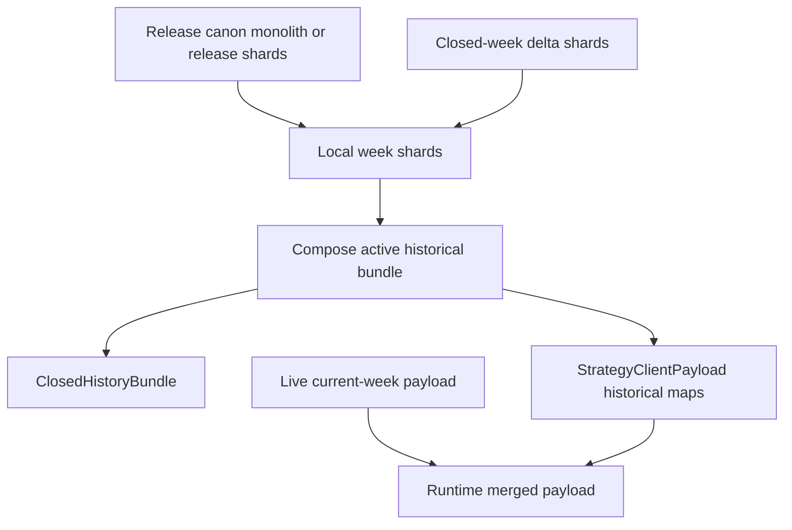

# Kernel Data Architecture Spec

> Design foundation for the Limni v2.x loading, cache, and version kernel. It does not authorize release-canon mutation, pushing, or tagging.

## Implementation Status

As of local `v2.0.2` work on 2026-06-01:

- Implemented: read-only inventory route, one-week shard route, deterministic release-canon shard derivation, server-derived closed-week delta shards, IndexedDB v2 shard stores, local gap helpers, non-blocking active-variant kernel sync, closed-history bundle composition, explicit active strategy kernel payload endpoint, Basket snapshot fallback through kernel-composed history, active Performance route release on kernel readiness, active-only strategy session boot on kernel routes, active kernel boot bypass of legacy strategy artifact repair/stamp checks, kernel-route bypass of delayed monolithic canon downloads, version badge kernel diagnostics, and Status page kernel diagnostics.
- Verified locally before final pass: first browser fill reached `Kernel: ready (18/18 weeks)` for `tandem-weekly_hold-none`; reload reused IndexedDB shards with one inventory request and zero week-shard requests. Final pass must verify the active `tandem-adr_grid-pair_fill_cap` delta path, Status page diagnostics, and absence of legacy strategy-page-data/status calls during active Performance boot.
- Not implemented yet: full retirement of the legacy canon gate for non-kernel routes/fallbacks, persistent server-side delta materialization/cache, background variant queue, aggregate shard population, and removal of old strategy repair/stamp machinery after additional browser verification.
- v2.0.2 scope decision: Matrix CFD/Crypto are intentionally degraded/provisional and must not participate in the Performance data kernel readiness gate.
- Constraint still active: no `releases/v2/canon/` mutation and no push/tag without Freedom approval.

## 1. Kernel State Machine

The kernel should be a small client-owned state machine that coordinates existing infrastructure stores. It should not hide behind incidental phases from `canonStore.ts` or `strategySessionStore.ts`. Its job is to make boot, historical readiness, runtime cache invalidation, closed-week catch-up, and live-week sync inspectable.

Recommended phases:

```text
idle
loading-release-manifest
syncing-cache-namespace
hydrating-local-release-canon
checking-closed-week-manifest
fetching-closed-week-deltas
composing-active-history
ready
live-syncing-current-week
background-syncing-variants
degraded
error
```

`hydrating-local-release-canon` is more precise than `hydrating-local-canon`, because the client historical layer will eventually include release canon plus closed-week deltas. `composing-active-history` is added because the app does not consume raw shards directly; it consumes `ClosedHistoryBundle` and `StrategyClientPayload`-like view models. `background-syncing-variants` is added so all-variant cache work cannot become a full-screen gate again.

| Phase | Entry Condition | Exit Condition | Failure Behavior | User-Facing Label | Timeout |
| --- | --- | --- | --- | --- | --- |
| `idle` | Kernel has not started or route bypasses app data boot. | Non-bypassed route mounts and calls `startKernel()`. | None. | None. | None. |
| `loading-release-manifest` | Startup begins. | `/api/version/current` returns a valid `ReleaseManifest`. | `error` if manifest cannot be loaded and no trusted local manifest exists; `degraded` if local manifest exists and route can render cached historical state. | `Checking app version...` | 10s, then degraded/error decision. |
| `syncing-cache-namespace` | Manifest loaded. | Stored namespace is compared to `cacheNamespace`; runtime caches are cleared if needed. | `error` only if namespace cleanup throws in a way that blocks correctness; otherwise continue and record degraded reason. | `Syncing runtime cache...` | 5s. |
| `hydrating-local-release-canon` | Namespace sync complete. | Active variant baseline shards or monolithic baseline fallback are available in memory. | `fetching-closed-week-deltas` if local cache misses but network can fetch; `degraded` if historical cache is partial; `error` if active historical view cannot be built. | `Restoring v2 history...` | 5s for local IndexedDB hydration; if network fallback is required, transition to the relevant network phase with its own timeout. Background variants do not extend the gate. |
| `checking-closed-week-manifest` | Local release baseline is known. | Server inventory manifest is loaded and compared with local inventory. | `degraded` if offline and local historical cache can render; `error` if active route requires missing closed weeks and no network is available. | `Checking closed weeks...` | 10s. |
| `fetching-closed-week-deltas` | Manifest diff finds missing or corrupt active-variant closed-week shards. | Required active-variant deltas are fetched, hashed, and persisted. | `degraded` if non-selected variants fail; `error` if active variant selected week cannot be recovered. | `Updating closed weeks...` | 30s for active variant, then page-level retry/degraded state. |
| `composing-active-history` | Release baseline and required deltas exist locally. | Active historical view model is composed and published to memory. | `error` if composition fails for active view; `degraded` if only optional aggregate data fails. | `Preparing performance history...` | 10s. |
| `ready` | Active historical view is complete enough to render. | Runtime live sync or background sync starts without leaving ready. | None. | None; app is visible. | None. |
| `live-syncing-current-week` | App is ready and active route needs current/open week. | Current-week payload fetch completes, returns empty, or fails. | Stay `ready`; expose current-week status at page level. Never block historical render. | Page-local: `Computing current week...` | 15s per attempt; hourly polling remains acceptable for v2.x until the historical/live boundary is stable. |
| `background-syncing-variants` | App is ready and idle enough to hydrate other variants. | Queue drains or pauses. | Record failed variants in debug snapshot; do not block app. | None by default. | Per-task budget, no global gate. |
| `degraded` | Kernel has enough local data to render but one required check failed or timed out. | Retry succeeds or user refreshes. | Escalate to `error` only when selected view cannot render. | Specific, not vague: `Using cached history; closed-week sync failed.` | Retry with backoff. |
| `error` | Active historical view cannot be rendered safely. | Manual retry or reload succeeds. | Stay error with diagnostic details. | `App data unavailable: <reason>` | None; explicit retry action. |

Readiness rule: the app becomes usable when the active strategy variant has its release baseline hydrated, required closed-week deltas caught up, and no corrupt or missing shard for the selected historical view. Other variants must lazy-sync after `ready`.

Out of kernel scope: `market-intelligence`, `news`, and `accounts` stay on their current session-store or page-level loading patterns. They can be refreshed after `ready`, but they must not participate in the historical data gate. This spec is for strategy/canon/live-week data only.

Cross-page sharing rule: the kernel should coordinate lifecycle, versioning, invalidation, and diagnostics, but actual reusable data should live in explicit domain stores. Pages should consume shared domain stores rather than creating hidden duplicate fetch/cache paths.

```text
Kernel
  version + cache + boot + diagnostics + readiness policy

Domain Stores
  performanceHistoryStore
  liveWeekStore
  marketIntelligenceStore
  newsStore
  accountsStore
  releaseDocsStore

Pages
  consume stores; do not own duplicate data pipes
```

Correct sharing examples:

- Performance Basket, Summary, Simulation, and sidebar consume the same composed historical strategy payload.
- Future Research verification can consume the same performance canon/delta shard layer when inspecting historical trades.
- Dashboard and Sentiment can share market-intelligence/session data where their source data overlaps.
- Accounts and Automation can share account/bot operational stores.
- Documents and the Version Badge read from the same release manifest/version source.

The kernel must not become a giant all-data store. It coordinates the rules; domain stores own the data. This preserves the no-drift rule: compute once, show everywhere.

The kernel must expose a debug snapshot:

```ts
interface KernelDebugSnapshot {
  phase: KernelPhase;
  appVersion: string | null;
  canonVersion: string | null;
  cacheNamespace: string | null;
  activeVariant: string | null;
  activeWeek: string | "all" | null;
  localWeeks: string[];
  serverWeeks: string[];
  missingWeeks: string[];
  corruptWeeks: string[];
  currentWeekOpenUtc: string | null;
  latestClosedWeekOpenUtc: string | null;
  liveWeekStatus: "idle" | "loading" | "ready" | "empty" | "error";
  degradedReasons: string[];
}
```

Rationale: future debugging should answer "what does the client have, what does the server have, and what is it waiting for?" without reading browser internals.

## 2. Canon Inventory Manifest (Server-Side)

The inventory manifest is the catch-up contract. It tells the client which closed historical shards exist for the active `canonVersion`, which are release-baseline weeks, and which are post-release closed-week deltas.

Recommended endpoint:

```text
GET /api/canon/{canonVersion}/inventory
```

This should be a new route rather than an extension of `/api/version/current`. `releaseManifest.ts` describes release identity. The inventory describes available historical data for the release line and can change as new weeks close without mutating frozen release files.

Recommended shape:

```ts
type CanonShardSource = "release-canon" | "closed-week-delta";

interface CanonWeekShardEntry {
  weekOpenUtc: string;
  source: CanonShardSource;
  schemaVersion: "canon-week-shard-v1";
  sha256: `sha256:${string}`;
  sizeBytes: number;
  generatedAtUtc: string;
  rowCounts: {
    rows: number;
    trades: number;
    pairs: number;
  };
}

interface CanonVariantInventory {
  strategyVariant: string;
  baselineWeeks: CanonWeekShardEntry[];
  deltaWeeks: CanonWeekShardEntry[];
  aggregate: {
    key: `${string}::${string}::aggregate`;
    schemaVersion: "canon-aggregate-shard-v1";
    sha256: `sha256:${string}` | null;
    sizeBytes: number;
    generatedAtUtc: string | null;
    status: "not-materialized" | "available";
  };
  latestClosedWeekOpenUtc: string | null;
}

interface CanonInventoryManifest {
  schemaVersion: "canon-inventory-v1";
  releaseLine: string;
  appVersion: string;
  canonVersion: string;
  cacheNamespace: string;
  currentWeekOpenUtc: string;
  latestClosedWeekOpenUtc: string | null;
  weekKeySemantics: "display-week-open-utc";
  variants: Record<string, CanonVariantInventory>;
  generatedAtUtc: string;
}
```

Weeks can be listed globally for convenience, but integrity must be per variant plus week because hashes and sizes differ by strategy variant. The manifest should therefore treat variant inventory as the authoritative fetch plan.

The manifest must distinguish `release-canon` and `closed-week-delta`. Release canon is frozen at release time. Closed-week delta is generated after release from canonical server data, immutable once generated for a given `schemaVersion`, `canonVersion`, strategy variant, and week.

The aggregate slot should exist in the manifest contract from Phase 1 even if no aggregate shard is populated initially. Path-dependent all-time stats such as max drawdown, Sharpe, Sortino, and cumulative simulation may not safely recompose through simple per-week addition. Reserving the aggregate slot now prevents a second manifest redesign if profiling or parity tests prove aggregate shards are required.

Week keys must not assume Monday `00:00Z`. Existing Limni behavior uses display week opens such as `2026-05-24T23:00:00.000Z` around DST/market boundaries. The spec standardizes shard identity on the display week open used by current performance UI and `getDisplayWeekOpenUtc`. Shard payloads must still carry canonical and execution anchor metadata for calculations that need them.

Rationale: keeping inventory separate from release identity preserves immutability while giving the client enough information to fetch one missing week instead of the full v2 canon.

Variant taxonomy must be explicit:

- Release canon variants are the materialized historical artifacts listed in `releaseManifest.canon.variants`.
- Runtime strategy selections are UI/API selections built from strategy, entry style, and risk overlay. There may be more runtime selections than release-canon variants.
- A runtime selection may map directly to a release canon variant, derive from a release canon variant plus live data, or remain non-canon/live-only until it is intentionally materialized.
- The kernel must not require every runtime strategy selection to have a release-canon shard before app readiness.

Rationale: the current app has release materialization and runtime preload tasks with different counts and responsibilities. The kernel should make that boundary explicit rather than letting all runtime tasks become historical canon requirements.

## 3. Per-Week Shard Schema

IndexedDB and server shard identity:

```text
{canonVersion}::{strategyVariant}::{weekOpenUtc}
```

Recommended shard type:

```ts
interface CanonWeekShard {
  metadata: {
    schemaVersion: "canon-week-shard-v1";
    canonVersion: string;
    releaseLine: string;
    appVersionPreparedFrom: string;
    strategyVariant: string;
    weekOpenUtc: string;
    weekCloseUtc: string;
    weekKeySemantics: "display-week-open-utc";
    source: "release-canon" | "closed-week-delta";
    generatedAtUtc: string;
    sourceHash: `sha256:${string}`;
    payloadHash: `sha256:${string}`;
    rowCounts: {
      rows: number;
      trades: number;
      pairs: number;
      weekResults: number;
    };
    anchors: {
      canonicalAnchorVersion: string;
      executionAnchorVersion: string;
      canonicalWeeks: string[];
      executionWeeks: string[];
    };
  };
  payload: {
    weekOptions: string[];
    engineWeekMap: NonNullable<StrategyClientPayload["engineWeekMap"]>;
    engineSimMap: NonNullable<StrategyClientPayload["engineSimMap"]>;
    engineWeekResults: NonNullable<StrategyClientPayload["engineWeekResults"]>;
    closedHistoryRows: ClosedHistoryBundle["rows"];
  };
}
```

The payload should mirror the current bundle structure but scoped to one week. This is the least risky transition because the app already consumes `engineWeekMap`, `engineSimMap`, `engineWeekResults`, and `ClosedHistoryBundle.rows`. Shards should not start as raw trade rows that require rebuilding all strategy projections client-side; that would move server computation into the browser and create a larger correctness surface.

Cross-week aggregates should use a hybrid:

- `weekOptions`, per-week maps, and basket rows compose directly from shards.
- All-time `sidebarStats` and cumulative simulation can be recomputed from composed week results when feasible.
- If recomposition is too slow or mathematically sensitive, populate the reserved aggregate shard per variant:

```text
{canonVersion}::{strategyVariant}::aggregate
```

The aggregate shard key and manifest slot are mandatory from Phase 1. The aggregate payload itself is optional until profiling or parity tests prove it is needed.

Rationale: one-week scoped current shapes allow the client to stitch data with minimal view changes, while preserving the option to optimize all-time aggregates later.

## 4. IndexedDB Store Design

Current IndexedDB has two stores: `bundles` and `meta`. The shard design should move to a versioned DB schema rather than overloading existing monolithic keys.

Recommended DB:

```text
DB_NAME: limni-canon
DB_VERSION: 2
```

Object stores:

```ts
interface CanonShardRecord {
  key: string; // canonVersion::strategyVariant::weekOpenUtc
  canonVersion: string;
  strategyVariant: string;
  weekOpenUtc: string;
  source: "release-canon" | "closed-week-delta";
  schemaVersion: "canon-week-shard-v1";
  payloadHash: string;
  storedAtUtc: string;
  shard: CanonWeekShard;
}

interface CanonInventoryRecord {
  key: string; // canonVersion::strategyVariant
  canonVersion: string;
  strategyVariant: string;
  weeks: string[];
  latestClosedWeekOpenUtc: string | null;
  updatedAtUtc: string;
}

interface CanonKernelMetaRecord {
  key: string; // active
  releaseLine: string;
  appVersion: string;
  canonVersion: string;
  cacheNamespace: string;
  schemaVersion: string;
  updatedAtUtc: string;
}
```

Stores and indexes:

| Store | Key Path | Indexes | Purpose |
| --- | --- | --- | --- |
| `weekShards` | `key` | `canonVersion`, `strategyVariant`, `[canonVersion, strategyVariant]`, `[canonVersion, strategyVariant, weekOpenUtc]` | Fast active-variant inventory and shard reads. |
| `inventories` | `key` | `canonVersion`, `strategyVariant` | Cached server manifest summary. |
| `kernelMeta` | `key` | `canonVersion`, `cacheNamespace` | Current release/cache coordination. |
| `bundles` | existing | existing | Legacy monolithic fallback during migration only. |
| `meta` | existing | existing | Legacy metadata fallback during migration only. |

Migration path:

1. Keep existing `bundles` and `meta` stores.
2. Add new stores in DB version 2.
3. On first run after upgrade, if a monolithic bundle exists and no week shards exist for the active variant, split the monolithic bundle into local `release-canon` shards without touching files under `releases/v2/canon/`.
4. Persist generated local shard records with source `release-canon` and a payload hash derived from the local shard payload.
5. Fetch closed-week deltas from the server inventory after local split.

Size estimate:

- Current monolith: about 7MB per strategy variant, about 87MB total for 12 release variants.
- Estimated shard: about 100-400KB per variant per week depending on strategy and trade count.
- If there are 22 closed weeks and 12 variants, expect roughly 264 shard records plus optional aggregate records.

Cleanup:

- `cacheNamespace` changes clear runtime/session caches, not `weekShards`.
- `canonVersion` changes mark old canon shards as inactive and may remove them after the new canon is ready.
- Keep at most the active `canonVersion` plus one previous version unless Freedom explicitly needs offline rollback.

Rationale: the migration must preserve existing v2 cache value while creating a shard inventory the kernel can reason about.

## 5. Client-Side Inventory & Gap Calculation

Core algorithm for active variant:

```text
1. Read release manifest.
2. Sync cache namespace.
3. Read local shard inventory for {canonVersion, activeVariant}.
4. If no local shards exist, hydrate/split existing monolithic release bundle or fetch current release baseline.
5. Fetch server inventory manifest.
6. Build expected active week set:
   baselineWeeks + deltaWeeks for activeVariant, excluding currentWeekOpenUtc.
7. Delta = expected weeks not present locally or present with hash mismatch.
8. Fetch only delta shards.
9. Persist verified shards.
10. Compose active historical view.
11. Mark kernel ready.
12. Lazy-sync non-active variants.
```

Recommended inventory structure in memory:

```ts
type VariantWeekInventory = Map<string, {
  weekOpenUtc: string;
  source: "release-canon" | "closed-week-delta";
  payloadHash: string;
  status: "local" | "missing" | "corrupt" | "fetching" | "ready";
}>;

type CanonInventoryByVariant = Map<string, VariantWeekInventory>;
```

For multiple variants, active variant catch-up is required before `ready`; non-active variants are background work. This prevents the current all-variant preload cost from returning under a new name.

Hash mismatch handling:

1. Delete only the corrupt shard record.
2. Re-fetch that exact variant/week shard.
3. If re-fetch succeeds and hash matches, continue.
4. If re-fetch fails for active selected week, enter `error`.
5. If re-fetch fails for a background variant, record degraded reason and continue.

Rationale: inventory diff is the institutional catch-up primitive. It is small, inspectable, and avoids global cache invalidation for a one-week gap.

## 6. Current-Week Live Isolation

Rules:

- Current/open week is never stored as a canon shard.
- Current/open week never satisfies historical readiness.
- Current/open week has a separate fetch and refresh cycle.
- Hourly polling is acceptable for v2.0.1; SSE/WebSocket is explicitly out of scope.
- A closed week becomes eligible for closed-week delta only after the server materializes it and publishes it in the inventory manifest.

Rollover detection:

The client should store the last seen `currentWeekOpenUtc` from the inventory manifest or current-week API. If a later manifest reports a different `currentWeekOpenUtc`, the client knows rollover occurred. It should then:

1. Stop treating the previous open week as live.
2. Check whether the previous week appears in `deltaWeeks`.
3. Fetch the closed-week delta if available.
4. Render the new current week as live/incomplete with explicit status.
5. Keep the previous week in a pending/degraded state only if the delta is not yet materialized.

The manifest alone can detect rollover if it includes both `currentWeekOpenUtc` and `latestClosedWeekOpenUtc`. The current-week API can be a secondary signal, not the source of historical truth.

Week status resolver:

```ts
type KernelWeekStatus =
  | "future"
  | "current_incomplete"
  | "closing_pending"
  | "closed_delta_available"
  | "closed_local"
  | "closed_missing"
  | "release_canon";
```

Rationale: the rollover bug class comes from current-week payloads masquerading as historical readiness. The kernel must enforce the boundary centrally.

## 7. Composition: How Shards Become App State

Current app consumers expect:

- `ClosedHistoryBundle`
- `StrategyClientPayload`
- `engineWeekMap`
- `engineSimMap`
- `engineWeekResults`
- `sidebarStats`
- `weekOptions`

Recommended approach: shards mirror current bundle structures but scoped to one week, then compose into current types in memory.

Composition flow:



Historical composition:

```ts
interface ComposedHistoricalVariant {
  strategyVariant: string;
  canonVersion: string;
  weeks: string[];
  closedHistoryBundle: ClosedHistoryBundle;
  strategyPayload: Pick<
    StrategyClientPayload,
    "engineWeekMap" | "engineSimMap" | "engineWeekResults" | "weekOptions" | "sidebarStats"
  >;
}
```

The composed result should be cached in memory for the active variant and invalidated when:

- a missing closed-week delta is added,
- a corrupt shard is replaced,
- `canonVersion` changes,
- view-mode interpretation changes in a way that requires runtime recomposition.

For all-time stats, start with server-compatible recomposition from per-week maps. If profiling shows that recomposition is too slow or results diverge from existing all-time metrics, add aggregate shards. Do not invent a new client math path without parity tests.

Rationale: matching current data shapes lowers migration risk and allows Phase 0/1 endpoints to be tested against existing payloads.

## 8. Migration Path

Each phase must be independently deployable and testable. The app must work at every intermediate state.

### Phase 0: Spec and Read-Only Contracts

Deliverables:

- This spec.
- No runtime code.
- No release manifest bump required for the spec itself unless Freedom chooses to document it in release notes.

Version discipline:

- Spec-only documentation does not require `appVersion`, `cacheNamespace`, or `canonVersion` changes.
- Implementation phases that alter runtime cache interpretation must bump `cacheNamespace`.
- Implementation phases that change frozen historical canon bytes must bump `canonVersion` and require explicit release approval.

### Phase 1: Read-Only Inventory and Shard API Over Existing Data

Deliverables:

- Inventory endpoint with the reserved aggregate slot.
- Shard endpoint capable of returning one variant/week by reading existing monolithic release artifacts or server-derived closed-week data.
- Old app flow remains active.

Constraints:

- Do not mutate `releases/v2/canon/`.
- Do not switch `AppPreloadGate`.
- Do not remove legacy cache code.
- Derive release-canon week shards on demand from existing monolithic artifacts. Do not create a second release-artifact source of truth outside `releases/v2/canon/`. If derivation is expensive, use deterministic server-side memoization only.

Test focus:

- Manifest shape.
- Hash integrity.
- May 25 rollover week appears as a delta if not in release baseline.

### Phase 2: IndexedDB Shard Store Beside Existing Store

Deliverables:

- New `weekShards`, `inventories`, and `kernelMeta` stores.
- Local split of existing monolithic bundles into `release-canon` shards when possible.
- Active-variant gap calculation.

Runtime still falls back to monolithic `canonStore.ts` if shard composition fails.

Version discipline:

- Bump `cacheNamespace`, because cache interpretation changes.
- Keep `canonVersion: v2` unless frozen canon artifacts are intentionally rematerialized.

### Phase 3: Kernel Gate Uses Shard Store

Deliverables:

- New kernel state machine drives app boot.
- Active variant gates readiness.
- Background variants lazy-sync after ready.
- Current-week live sync is page-level, not global full-screen loading.

Version discipline:

- Bump `cacheNamespace`.
- Update app version badge/docs/release history/open issues before push.

### Phase 4: Retire Monolithic Canon Gate

Deliverables:

- Remove full-screen dependency on monolithic `ClosedHistoryBundle` preload.
- Keep a compatibility reader only if needed for rollback.
- Strategy repair flows no longer participate in app boot.

### Phase 5: Native Per-Week Release Canon on Next Intentional Canon Release

Deliverables:

- Future release can materialize native per-week release canon shards.
- This is the first phase that may touch release canon artifacts, and only for a new canon version or explicitly approved rematerialization.

Rationale: v2.0.1 should bridge from existing monoliths to local shards without pretending the frozen v2 release files changed.

## 9. What Gets Retired

| File / Function | Retirement Phase | Replacement |
| --- | --- | --- |
| `GLOBAL_PRELOAD_CACHE_VERSION` as a broad binary stamp in `preloadContract.ts` | Phase 3 or 4 | Kernel `cacheNamespace` plus shard inventory/hash validation. |
| `writeGlobalPreloadStamp()` / `hasTrustedGlobalPreloadStamp()` | Phase 4 | Kernel meta and per-shard inventory. |
| `runBackgroundRepairs()` in `strategySessionStore.ts` | Phase 4 | Missing shard delta fetch plus server materialization status. |
| `checkVersionsAndRepreload()` in `strategySessionStore.ts` | Phase 4 | Release manifest + inventory diff. |
| Broad all-strategy preload in `runPostGatePreloadTasks()` | Phase 3 | `background-syncing-variants` lazy queue. |
| Blocking strategy work in `AppPreloadGate.tsx` | Phase 3 | Kernel active historical readiness only. |
| `fetchCanonBundle()` monolithic fetch in `canonStore.ts` | Phase 4 or 5 | Fetch active variant/week shards; keep monolith split fallback until native shards exist. |
| IndexedDB `bundles` store as primary canon storage | Phase 4 | `weekShards` store. |
| Current-week-only completeness guard patches as scattered logic | Phase 3 | Central `KernelWeekStatus` and live isolation rules. |

Do not delete quarantined or legacy code until the replacement has passed empirical browser verification and Freedom approves cleanup.

## 10. Acceptance Tests

Acceptance tests should be defined before each implementation phase. They should include unit-level inventory tests, API contract tests, and browser verification.

### Phase 1 Tests

- Inventory endpoint returns release identity, current week, latest closed week, variant inventory, reserved aggregate slots, and per-variant hashes.
- Shard endpoint returns exactly one variant/week shard.
- Hash in inventory matches shard payload.
- Existing monolithic app boot still works.

### Phase 2 Tests

- First visit with no cache downloads active variant baseline shards before background variants.
- Existing monolithic `v2` IndexedDB bundle can be split into local `release-canon` shards without network refetch.
- Client with N local weeks and N+1 server weeks fetches only one shard.
- Shard hash mismatch deletes and re-fetches only that shard.

### Phase 3 Tests

- Cache namespace bump invalidates runtime/session caches but retains canon shards.
- Canon version bump causes old shards to be ignored and new baseline to load cleanly.
- App reaches `ready` after active variant catches up; other variants continue in background.
- Full-screen loader never cycles through vague strategy/current-week labels.
- Kernel debug snapshot accurately lists phase, local weeks, server weeks, missing weeks, current week, and degraded reasons.

### Rollover Tests

- At rollover, new current week appears as `current_incomplete`.
- Previous week remains selectable.
- If previous week delta is materialized, client fetches only that closed-week shard.
- If previous week delta is not materialized, UI reports `closing_pending` rather than an empty historical result.
- ADR Grid execution-anchor weekly returns are represented; missing execution rows cannot masquerade as a valid empty week.

### Offline / Stale Tests

- Client offline for three weeks catches up with exactly three delta shards after reconnect.
- Stale inventory can render cached historical data in `degraded` mode.
- Corrupt active selected week produces a specific error and retry path.

### Version and Issue Discipline Tests

- Any runtime implementation updates `release-manifest.json`, `releases/v2/manifest.json`, `releases/v2/changes.md`, `releases/v2/patches/<version>.md`, and app-visible version history as needed before push.
- `releases/v2/open-issues.md` maps each open issue to either resolved, monitoring, or explicitly deferred.
- No implementation phase pushes or tags until Freedom approves.

### Current Open Issue Coverage

The spec is intended to resolve the current v2 open issues once implemented and empirically verified, but the issues should not be marked closed at spec time.

| Open Issue | Kernel Resolution Path | Closure Condition |
| --- | --- | --- |
| `1. Week Rollover / Recent Week Empty State Regression` | Closed weeks move through inventory and delta shards; current week cannot satisfy historical readiness; execution-anchor coverage is part of shard metadata and acceptance tests. | Browser rollover verification shows previous closed week remains populated, new week is explicitly live/incomplete, and only missing delta shards are fetched. |
| `1a. Current-Week Basket Legacy Renderer Regression` | Live-week isolation keeps current Basket live-only while enforcing shared row language and preventing closed-history canon paths from leaking into current-week fallback logic. | Current-week Basket renders the approved hierarchy-style live renderer and closed weeks render from historical shards without style drift. |
| `2. Preloader Status Loop / Legacy Broad Strategy Gate` | Kernel active-first state machine replaces broad strategy repair as a full-screen gate; background variants lazy-sync after `ready`; debug snapshot explains every waiting state. | Cached reload reaches app after active historical readiness, without vague strategy/current-week loader loops, and debug snapshot identifies any degraded condition. |

## 11. Risk Register

| Risk | Likelihood | Impact | Mitigation |
| --- | --- | --- | --- |
| All-time stats diverge after shard composition. | Medium | High | Reserve aggregate shard slots from Phase 1, start with current per-week payload shapes, add parity tests against existing monoliths, and populate aggregate shards when profiling or parity requires them. |
| v2 frozen canon is accidentally rematerialized. | Low | Critical | Phase 1-4 must read or split existing monoliths only; no writes under `releases/v2/canon/`. |
| Week key semantics drift between display, canonical, and execution anchors. | Medium | High | Standardize shard key on display week open; include canonical/execution anchor metadata in every shard; test ADR Grid execution-anchor rows. |
| Inventory lists weeks globally but variant hashes differ. | Medium | Medium | Authoritative inventory must be per variant plus week; global weeks only convenience. |
| Active-first readiness accidentally becomes all-variant readiness. | Medium | High | State machine ready rule gates active variant only; background queue has no full-screen UI. |
| IndexedDB migration fails in private mode or quota pressure. | Medium | Medium | Degrade to memory plus network fetch; provide specific error; do not corrupt old `bundles` store. |
| Runtime cache namespace and shard inventory get conflated. | Medium | High | `cacheNamespace` clears runtime/session caches only; `canonVersion` governs shard validity. |
| Closed-week delta generated before data is truly complete. | Medium | High | Server manifest should publish a week only after canonical and execution anchor coverage checks pass. |
| WebSocket/SSE scope creep. | Low | Medium | Explicitly out of scope; hourly polling remains until historical/live boundary is stable. |
| Spec implementation updates app behavior but not release history. | Medium | Medium | Add version/update checklist to implementation acceptance tests and PR/release workflow. |

Resolved implementation decisions:

- Phase 1 shard API derives shards on demand from existing monoliths. The derivation must be deterministic so the same input produces the same shard hash. Server-side memoization is acceptable, but new release artifacts outside `releases/v2/canon/` are not.
- Aggregate shard slots are part of the manifest contract from Phase 1. Aggregate payloads are populated only after profiling or metric parity proves they are needed.
- Kernel debug state should be available in dev tools/logs and summarized in the existing version badge popover, for example `Kernel: ready (22/22 weeks)`.
- Runtime implementation starts at `v2.0.2`. `v2.0.1` remains the contained week-rollover/cache-readiness patch and should ship only after browser verification.
